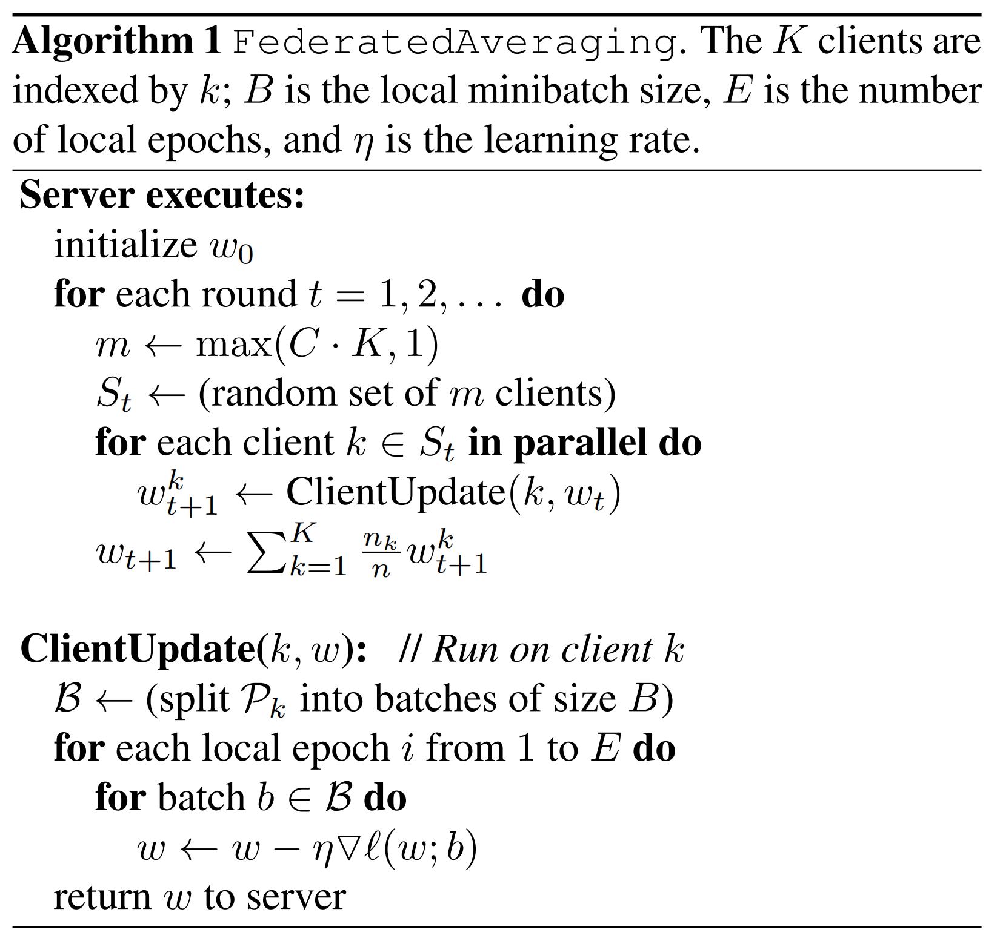
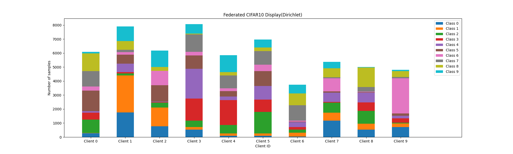
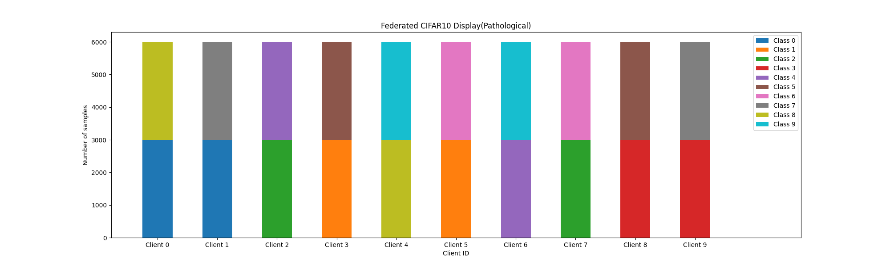

<!--
 * @Descripttion: 
 * @Version: 1.0
 * @Author: ZhangHongYu
 * @Date: 2022-07-04 17:31:00
 * @LastEditors: ZhangHongYu
 * @LastEditTime: 2022-07-07 15:14:04
-->
<!--
 * @Descripttion: 
 * @Version: 1.0
 * @Author: ZhangHongYu
 * @Date: 2022-07-03 20:27:59
 * @LastEditors: ZhangHongYu
 * @LastEditTime: 2022-07-04 17:04:43
-->
<p align="center">

</p>

<div align="center">

# FedAO: 联邦学习算法的一站式工具箱

[](https://github.com/orion-orion/CNN-LSTM-Flow-Analysis)[](https://github.com/orion-orion/FedAO/blob/master/LICENSE)[](https://github.com/orion-orion/FedAO)
<br/>
[](https://github.com/orion-orion/FedAO) [](https://github.com/orion-orion/FedAO) 
</div>

## 1 简介
[FedAO](https://github.com/orion-orion/FedAO)（Federated Learning All in One）为联邦学习（federated learning）的工具箱，旨在提供联邦学习中[FedAvg](http://proceedings.mlr.press/v54/mcmahan17a?ref=https://githubhelp.com)<sup>[1]</sup>、[FedProx](https://proceedings.mlsys.org/papers/2020/176)<sup>[2]</sup>等算法的Pytorch/Tensorflow、单机/分布式（distributed）、同步/异步（asynchronous）的多版本实现。

如果您还不熟悉分布式机器学习/联邦学习，可以先阅读我的博客[《分布式机器学习、联邦学习、多智能体的区别和联系》](https://www.cnblogs.com/orion-orion/p/15676710.html)学习预备知识 (#\^.\^#)~ 。联邦学习的优化目标为：

$$
\begin{aligned}
    f(w) &= \sum_{k=1}^K \frac{n_k}{n} F_k(w) \\
    F_k(w) &= \frac{1}{n_k}\sum_{i = 1}^{n_k}\mathcal{l}(h(x_i; w), y_i)
\end{aligned}
$$

其中 $K$ 为客户端的数量， $n_k$ 为第 $k$ 个节点的样本数量。联邦学习中最基础的FedAvg算法的伪代码如下图所示：

<p align="center">

</p>

这里 $K$ 为客户端的数量， $B$ 为本地迭代的batch size大小， $E$ 为本地迭代次数（local epochs）， $\eta$ 为学习率。

注意，我们将数据按照Dirichlet分布或者病态非独立同分布（即FedAvg原始论文中所采用的方法）划分好数据集后，再根据用户给定比例在本地划分训练/验证/测试集。除了模型参数的聚合按照本地训练集样本数量进行加权之外，模型在本地验证/测试后的结果也会按照本地验证/测试集样本数量进行加权，得到模型全局的验证/测试结果。

有关联邦学习划分方法的详细介绍可以参看我的博客[《联邦学习：按Dirichlet分布划分Non-IID样本》](https://www.cnblogs.com/orion-orion/p/15897853.html)和[《联邦学习：按病态非独立同分布划分Non-IID样本 》](https://www.cnblogs.com/orion-orion/p/15631167.html)。

## 2 环境依赖
由于该项目涉及 Pytorch 和 Tensorflow 两个不同的框架，它们的环境需求各不相同，用户可自行安装对应的Anaconda环境。
 - **Pytorch** 涉及 Pytorch 代码的 Python 版本为 3.8.13 ，其余环境配置如下：
    ```text
    numpy==1.22.3  
    tqdm
    matplotlib
    scikit-learn==1.1.1 
    pytorch==1.7.1 
    ```


- **Tensorflow** 涉及 Tensorflow 代码的Python版本为 3.8.15，且我的 CUDA 版本是 11。因为 Tensorflow 1.15 只支持Python 3.7 和CUDA 10，所以我使用了下列命令以在 CUDA 11 上安装 Tensorflow 1.15:

    ```bash
    pip install --upgrade pip
    pip install nvidia-pyindex
    pip install nvidia-tensorflow[horovod]
    pip install nvidia-tensorboard==1.15
    ```
    除了Tensorflow之外，其余环境配置如下：
    ```text
    numpy==1.20.0   
    tqdm
    matplotlib
    scikit-learn==1.2.0     
    ```

## 3 数据集

本项目统一使用 Torchvision 和 Keras 中的内置数据集，在代码中会自动下载和加载，无需自行下载。 Pytorch 版本支持`EMNIST`、`FashionMNST`,`CIFAR10`, `CIFAR100`数据集，Tensorfow版本支持`CIFAR10`、`CIFAR100`数据集（Keras 的`EMNIST`和`FashionMNIST`数据集需要翻墙下载，大家挂梯子或自行下载后离线读取即可）。

Torchvision 数据集下载后存放在当前代码运行目录的`data`文件夹下，Keras数据集下载后存放在`~/.keras/datasets`目录下。

数据集可以选择按照Dirichet分布和病态非独立同分布（即联邦学习原始论文中所采用的方法）两种不同的方式进行划分。

CIFAR10数据集按照Dirichlet分布（ $\alpha=1.0$ ）划分可视化如下：



CIFAR10数据集按照病态非独立同分布（pathological）（ 每个client包含 $2$ 个类）的划分可视化如下：



## 4 项目目录说明

```bash
FedAO
├── data_utils                             各版本通用的数据划分和可视化代码
│   ├── __init__.py                        包初始化文件    
│   ├── data_split.py                      数据集划分算法的实现 
│   └── plot.py                            数据集划分可视化 
├── fed_multiprocess_syn                   单机多进程同步算法版本（Pytorch实现）
│   ├── client.py                          客户端模型训练和验证    
│   ├── fl.py                              联邦学习总流程（含通信等） 
│   ├── main.py                            主函数，包括了整个数据pipline
│   ├── model.py                           模型架构
│   ├── server.py                          服务器端参数聚合 
│   ├── subset.py                          自定义Pytorch数据集 
│   └── utils.py                           数据集加载等工具函数 
├── fed_pytorch                            单机串行模拟版本（Pytorch实现）
│   ├── ...
├── fed_RPC_asyn                           分布式异步算法版本（Pytorch实现）
│   ├── ...
└──fed_tf                                  单机串行模拟版本（Tensorflow实现）
    ├── ...
```
## 5 使用方法
### 5.1 Pytorch单机串行版本

您可以先进入到对应目录下，然后运行`main.py`来训练/验证/测试模型。例如:
```bash
cd fed_pytorch    
python main.py \
        --dataset CIFAR10 \
        --n_clients 10 \
        --global_epochs 200 \
        --local_epochs 1 \
        --fed_method FedAvg    
```
其中`--dataset`参数用于选择数据集，`--n_clients`参数用于指定客户端的个数，`--global_epochs`用于指定全局迭代轮数，`--local_epochs`用于指定本地迭代轮数，`--fed_method`参数用于指定所采用的联邦学习方法。

训练完成后, 你可以在代码运行目录的`log`子目录下查看训练/验证/测试的日志情况。此外，数据集划分的可视化也存放在`log`目录下，大家可以前去查看。

如果需要使用FedProx方法来进行训练，则可使用如下命令：
```bash
cd fed_pytorch    
python main.py \
        --dataset CIFAR10 \
        --n_clients 10 \
        --global_epochs 200 \
        --local_epochs 1 \
        --fed_method FedProx \
        --mu 0.01
```
这里多出了一个参数`--mu`，表示FedProx方法中的近端正则项的系数。其余参数的含义与Pytorch单机串行版本完全相同，此处不再赘述。

### 5.2 Tensorflow单机串行版本

同样，先进入到对应目录下，然后运行`main.py`来训练/验证/测试模型。例如:
```bash
cd fed_tf  
python main.py \
        --dataset CIFAR10 \
        --n_clients 10 \
        --global_epochs 200 \
        --local_epochs 1 \
        --fed_method FedAvg 
```
参数的含义与Pytorch单机串行版本完全相同，此处不再赘述。

### 5.3 Pytorch单机多进程同步版本

同样，先进入到对应目录下，然后运行`main.py`来训练/验证/测试模型。例如:
```bash
cd fed_multiprocess_syn
python main.py \
        --dataset CIFAR10 \
        --n_clients 10 \
        --global_epochs 200 \
        --local_epochs 1 \
        --fed_method FedAvg 
```
参数的含义与Pytorch单机串行版本完全相同，此处也不再赘述。不过在这里需要注意，在我们的实现中一个进程对应一个client，故用户设置的client数量最好不要太大，否则可能会影响并行效率从而接近串行版本。

### 5.4 Pytorch分布式异步版本

同样，先进入到对应目录下，然后运行`main.py`来训练/验证/测试模型。例如:
```bash
cd fed_RPC_asyn
python main.py \
        --dataset CIFAR10 \
        --n_clients 10 \
        --global_epochs 200 \
        --local_epochs 1 \
        --lam 0.5 \
        --fed_method FedAvg
```
这里参数的含义与前面也相同，不过要多出一个参数 $\lambda$，用于确定在服务端更新模型时，历史模型和新模型对应的加权，更新公式为 $w^{t+1} = w^t + w_{new}$（参照异步联邦学习论文[《Asynchronous federated optimization》](https://arxiv.org/abs/1903.03934)）。我们这里默认通信域大小为`n_clients + 1`，其中rank为0的进程为master，其余为worker，其中master进程IP地址为`localhost`，端口号`29500`，master进程与worker进程之间采用RPC进行通信。


## 参考

[1] McMahan B, Moore E, Ramage D, et al. Communication-efficient learning of deep networks from decentralized data[C]//Artificial intelligence and statistics. PMLR, 2017: 1273-1282.

[2] Li T, Sahu A K, Zaheer M, et al. Federated optimization in heterogeneous networks[J]. Proceedings of Machine learning and systems, 2020, 2: 429-450.
